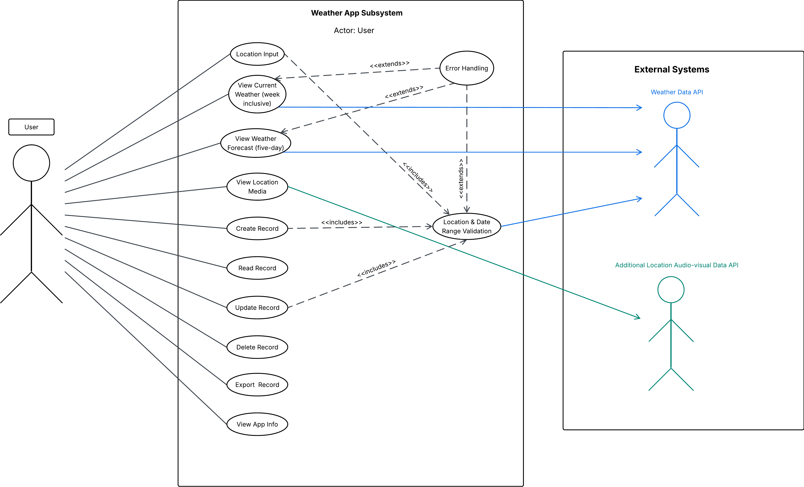
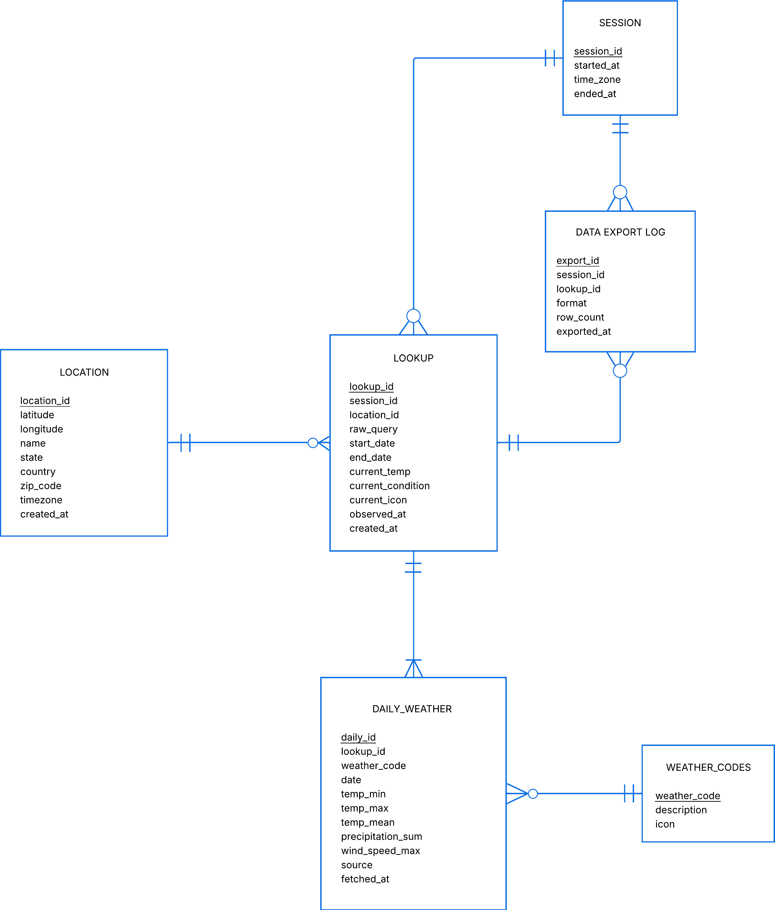
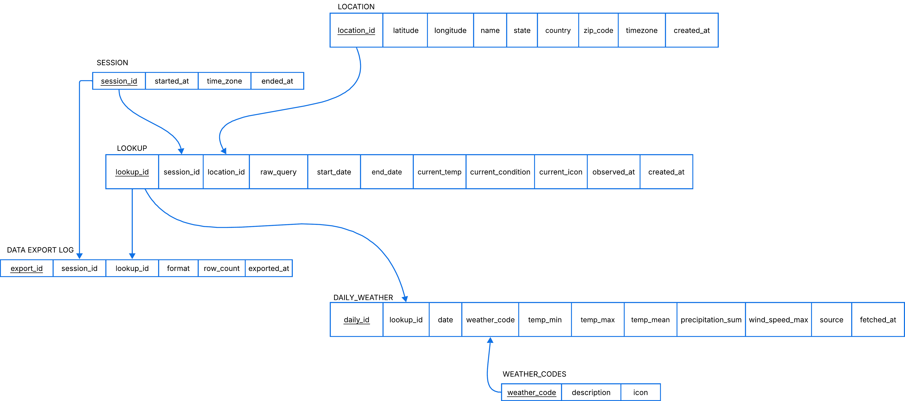
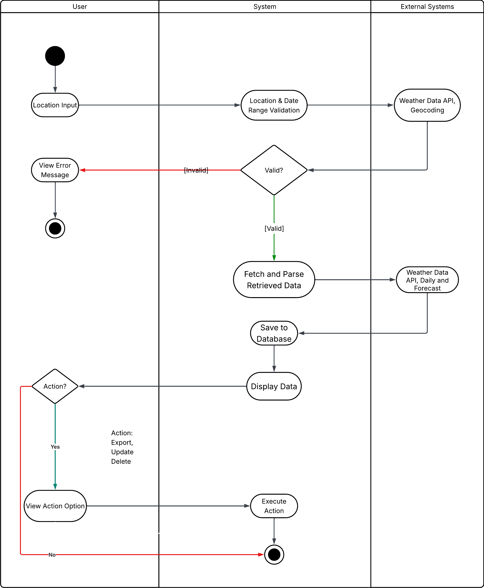
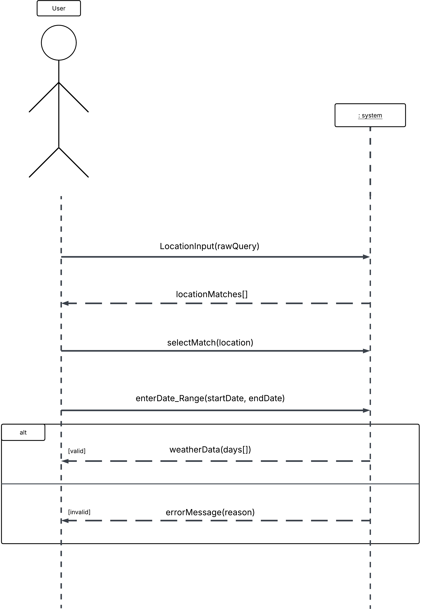

# Weather App — PM Accelerator AI Engineer Intern Tech Assessment (FullStack)

**Submitted by:** Tony Wang

**Assessments Completed:** **Tech Assessment #1 (Frontend) and #2 (Backend) — Full Stack**

A weather application that accepts flexible location input, retrieves real-time data from two
independent weather providers, persists it in a relational database with full CRUD, and exports
records to CSV.

> **Status:** complete — backend, frontend, and the bonus media integration.

---

## Contents

- [Demo Video](#demo-video)
- [The System](#what-this-is)
- [System Architecture](#architecture)
- [System Design](#system-design)
- [Tech Stack](#tech-stack-and-why)
- [Running Locally](#running-it-locally)
- [API Reference](#api-reference)
- [Data Model](#data-model)
- [Design Decisions](#design-decisions)
- [Requirement Coverage](#requirement-coverage)
- [Known Simplifications](#known-simplifications)

---

## Demo Video

<!-- TODO: paste the viewable URL here (Google Drive / YouTube / Vimeo) -->
_Link to be added._

---

## The System

The user enters a location in any form — city name, postal code, coordinates, or a landmark —
and the app resolves it to a real place, shows current conditions and a forecast, and lets them
save a location plus a date range as a persistent record they can read back, edit, delete, and
export.

Two weather providers are used deliberately, each for what it does best:

| Provider | Used for | Why |
|---|---|---|
| **OpenWeather** | geocoding, current conditions, icons | Geocoding returns up to 5 ranked matches, which powers location disambiguation |
| **Open-Meteo** | daily data stored in the database | Returns daily aggregates natively, in local time, with no API key |
| **YouTube Data API v3** | walking-tour videos for the searched city | Bonus media integration; results are cached in memory because search costs 100 of 10,000 daily quota units |

---

## System Architecture

```
Browser (frontend)    ──►    FastAPI backend     ──►  OpenWeather  (geocoding + current)
                                   │             ──►  Open-Meteo   (daily forecast/archive)
                                   ▼             ──►  YouTube      (walking-tour videos)
                          SQLite (weather.db)
```

The frontend never contacts a weather provider directly. All external calls, all database access,
and the API key live server-side. This keeps the key out of the browser and lets the frontend speak
one consistent vocabulary regardless of which provider supplied the data.

---

## System Design

The application was designed before it was written. These are the analysis artifacts:

### Use Case Diagram


### Entity Relationship Diagram


### Relations Diagram


### Activity Diagram


### System Sequence Diagram


Diagrams follow the conventions in *Systems Analysis and Design in a Changing World*
(Satzinger, Jackson & Burd, 7th ed.). Full written analysis:
[`docs/system-analysis-documentation.docx`](docs/system-analysis-documentation.docx).

---

## Tech stack and why

| Layer | Choice | Reasoning |
|---|---|---|
| Backend | **Python 3.13 + FastAPI** | Type hints drive request validation and auto-generated interactive docs |
| Database | **SQLite** | Zero setup — no server, no credentials. A reviewer clones and runs; the database builds itself on first start. The schema is standard SQL and ports to PostgreSQL unchanged |
| HTTP client | **requests** | Server-side calls to both providers |
| Config | **python-dotenv** | Keeps the API key out of a public repository |
| Frontend | **React + TanStack Start (TypeScript)** | JavaScript stack as required; TypeScript catches shape mismatches against the API before they reach the browser |
| Styling | **Tailwind CSS** | Utility classes keep the one-page layout in the markup rather than in a parallel stylesheet |
| Map | **Leaflet + OpenStreetMap** | No API key, no billing account, no quota — the coordinates already stored on every location are all it needs |
| Data fetching | **TanStack Query** | Caching and invalidation after create, update, and delete, so the history list stays honest without manual refetching |

---

## Running Locally

### Prerequisites
- Python 3.13
- Node.js 20+ (for the frontend)
- A free [OpenWeather API key](https://openweathermap.org/api) (Open-Meteo needs none)
- Optional: a [YouTube Data API v3 key](https://console.cloud.google.com/) for the walking-tour
  videos. Without it the app runs normally and simply shows none.

### Backend

```bash
cd backend
python -m venv .venv
.venv\Scripts\activate           # Windows
# source .venv/bin/activate      # macOS / Linux
pip install -r requirements.txt
```

Create `backend/.env`:

```
OPENWEATHER_API_KEY=your_key_here
YOUTUBE_API_KEY=your_key_here      # optional
```

Start the server from the **project root**:

```bash
uvicorn app.main:app --reload --app-dir backend
```

- API: <http://127.0.0.1:8000>
- **Interactive docs: <http://127.0.0.1:8000/docs>** — every endpoint is callable from the browser

The database is created and seeded automatically on first start. No migration step.
The API allows browser requests from `localhost:8080` — the port this project's Vite config serves
on — plus `localhost:5173` and `localhost:3000` and their `127.0.0.1` spellings. If the frontend is
served from anywhere else, add that origin to `ALLOWED_ORIGINS` in `backend/app/main.py`; otherwise
the browser blocks every response, even though the server answers correctly.

### Frontend

In a second terminal, from the **`frontend` folder**:

```bash
npm install
npm run dev
```

- App: <http://localhost:8080>

The frontend needs no API keys and no authentication. It reads the backend URL from
`VITE_WEATHER_API_BASE`, defaulting to `http://localhost:8000`, so nothing needs configuring for
local use. Set that variable only if the backend runs elsewhere.

Both servers must be running: the page loads without the backend, but every request fails.

---

## API Reference

| Method | Path | Purpose |
|---|---|---|
| `GET` | `/api/info` | Developer details and PM Accelerator description |
| `POST` | `/api/sessions` | Start a visit; returns a `session_id` |
| `GET` | `/api/geocode?q=&limit=` | Up to 5 ranked candidate places, so the user can disambiguate before anything is stored |
| `GET` | `/api/geocode/reverse?lat=&lon=` | Resolve browser-reported coordinates to a place name |
| `POST` | `/api/lookups` | **Create** — validate, fetch from both providers, persist |
| `GET` | `/api/lookups` | **Read all** — every stored record, newest first |
| `GET` | `/api/lookups/{id}` | **Read one** — full record with nested daily rows |
| `PUT` | `/api/lookups/{id}` | **Update** — re-validate, re-fetch, replace daily rows |
| `DELETE` | `/api/lookups/{id}` | **Delete** — cascades to daily rows |
| `GET` | `/api/lookups/{id}/export?format=csv` | **Export** to CSV, logged in `export_log` |
| `GET` | `/api/lookups/{id}/videos` | Walking-tour videos for the record's city; empty list if unavailable |

Errors use meaningful status codes: `422` for invalid input, `404` for a missing record,
`502` when an upstream provider fails.

---

## Data Model

Six tables. See [`backend/app/db/schema.sql`](backend/app/db/schema.sql).

| Table | Holds |
|---|---|
| `location` | One row per real place, deduplicated on `UNIQUE(latitude, longitude)` |
| `session` | One row per visit |
| `lookup` | One row per search — the user's raw query, date range, and a current-conditions snapshot |
| `daily_weather` | One row per day, cascading from `lookup` |
| `weather_codes` | WMO codes 0–99 seeded with descriptions and icon names |
| `export_log` | One row per export |

---

## Design Decisions

**Two providers, split by use case rather than by field.** Only Open-Meteo data is stored in
`daily_weather`, so the two providers' condition vocabularies never occupy the same column.
OpenWeather's data lives in separate snapshot columns on `lookup`.

**Open-Meteo returns daily aggregates in local time.** OpenWeather's forecast returns 3-hour
intervals in UTC, which would require deriving daily min/max and applying a timezone offset to
determine day boundaries. Delegating that to a provider that does it natively removes an entire
class of off-by-one-day bugs.

**Coordinates are rounded to 4 decimal places (~11 m) at the geocoding boundary.** Providers return
slightly different coordinates for the same place depending on the query string, which would defeat
`UNIQUE(latitude, longitude)`. Rounding on entry makes deduplication reliable.

**Reverse geocoding resolves to the canonical city, not the exact point.** Coordinates inside the
Bronx come back as "New York" with Manhattan's coordinates rather than the ones supplied. The
displayed name is therefore coarser than the user's actual position — acceptable for weather, which
is a city-scale phenomenon — and it has a useful consequence: a GPS-detected location and a typed
one resolve to identical coordinates, so they deduplicate to a single `location` row instead of
forking into two.

**The raw user query is stored alongside the resolved location.** `raw_query` records what was
typed; `location` records what it resolved to. They are usually different, and both matter.

**Observed data is immutable to users.** `UPDATE` may change the location, the date range, and
notes — the *question*. It cannot change a temperature — the *answer*. When the question changes,
the answer is re-fetched from the provider and replaced. Editing observed data would make it no
longer observed.

**Updates replace rather than reconcile.** Changing a date range deletes all daily rows and inserts
the new set, rather than computing a diff. The end state then depends only on the new data, never on
what happened to be stored before — which also makes "refresh" free: submit the same values and the
record re-derives from source.

**Deletion cascades downward.** Removing a lookup removes its daily rows and export log entries;
it does not remove the location, which is a fact about the world rather than about the search.

---

## Requirement Coverage

| ID | Requirement | Status |
|---|---|---|
| B1 | CREATE — location + date range → temperatures, stored | ✅ |
| B1a | Validate date range | ✅ `1940-01-01` to `today + 16 days`, plus start ≤ end |
| B1b | Validate location exists / fuzzy match | ✅ geocoding with up to 5 ranked candidates |
| B2 | READ — stored records | ✅ list and detail |
| B3 | UPDATE — with validation | ✅ re-validates and re-fetches |
| B4 | DELETE | ✅ cascades |
| B5 | RESTful API | ✅ `GET` / `POST` / `PUT` / `DELETE`, resource-oriented URLs |
| B6 | Additional API integration | ✅ YouTube Data API v3 — "4K {city} walking tour", proxied server-side |
| B7 | Data export | ✅ CSV |
| F1–F8 | Frontend | ✅ one page: search with disambiguation, browser geolocation, current conditions, 5-day forecast, map, videos, and full CRUD with CSV export |
| X1 | Developer name in app | ✅ shown in the UI, and served by `/api/info` |
| X2 | PM Accelerator description in app | ✅ shown in the UI, and served by `/api/info` |

---

## Known Simplifications

Deliberate trade-offs, noted rather than hidden:

- **Sessions are passed as an explicit parameter.** In production a session id belongs in a signed
  cookie or header — it is ambient context, not a caller-supplied option.
- **Update is not wrapped in a single transaction.** The update, delete, and insert are three
  commits. On a single-user local database the risk is theoretical, but a transaction would be
  correct.
- **No authentication.** The assessment states row-level security is not required, so all records
  are visible to everyone.
- **CSV is the only export format implemented.** The schema and endpoint accommodate JSON, XML,
  Markdown, and PDF.
- **Video results are cached in memory, not persisted.** A module-level dictionary keyed by city
  survives between requests but is lost on restart. YouTube's `search.list` costs 100 of 10,000
  daily quota units — roughly 100 searches per day — so caching is a necessity rather than an
  optimisation. A production version would persist results with a TTL.
- **`LookupRecord` describes the detail response, and list rows are cast to it.** `GET /api/lookups`
  returns a summary without daily rows or coordinates. Splitting the type into a summary and a
  detail record would make that impossible to confuse.

---

## License

<!-- TODO: optional. MIT is a reasonable default for a public assessment repo. -->
